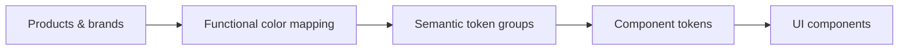

# Color Token Architecture

This document explains how the Svenska Spel color system is structured in
Figma, how collections relate to each other, and how brand expression is
translated into semantic UI usage.

For practical usage guidance, see [ColorSystem.md](./ColorSystem.md).

For the normalized token structure used in this repo, see
[Design Tokens](/Users/joakim/Documents/GitHub/svs-ui-nova-make-kit/src/design-tokens/README.md).

---

## Architecture at a Glance

The Nova color system is built as a mapping architecture, not as a flat palette
library.

The intended flow is:

1. **Products & brands**
2. **Functional color mapping**
3. **Semantic token groups**
4. **Component and state usage**

In practice, this means product branding is not applied directly to UI
components. Instead, it is translated into a stable semantic system so products
can feel distinct while interfaces still behave consistently.

---

## Collection Model in Figma

The variable library uses a parent-and-extension structure.

### Global Colors

Shared foundational colors used across the ecosystem.

- role: common base palette
- scope: neutrals, shared tones, cross-product anchors
- count in reviewed export: `151`

### Primitive Colors

Product-oriented primitive sets used as the raw material for theming.

- role: concrete product color families
- scope: product cores such as `Svs/Core/*`, `Bingo/Core/*`, `Poker/Amber/*`
- count in reviewed export: `1050`
- note: mostly primitive, but includes some aliases back to `Global Colors`

### Svenska Spel

The parent semantic theme collection.

- role: defines the semantic shape of the system
- modes:
  - `Light`
  - `Light Secondary`
  - `Dark`
  - `Vibrant`
- count in reviewed export: `149` semantic variables

### Product Theme Collections

Collections such as `Bingo`, `Casino`, `Keno`, `Oddset`, and others extend the
parent theme.

- role: product-specific semantic remapping
- behavior: reuse the same semantic structure as `Svenska Spel`
- mechanism: override selected aliases into product primitives
- result: consistent UI behavior with brand-specific expression

---

## The Core Idea

The system does **not** say “this component should use red 500.”

It says:

- this area is a `Surface`
- this overlay is a `Layer`
- this action uses `Accent`
- this state is `hover`, `pressed`, or `selected`

That indirection is the point. It allows:

- product-specific branding without rewriting component logic
- a stable structure across many products
- theme and mode changes without rethinking every component
- clearer governance when the system evolves

---

## Semantic Token Groups

The semantic layer is organized into a stable set of groups that describe UI
roles rather than raw color names.

### Accent

Used for product expression, primary actions, emphasis, and selected moments.

Common structure includes:
- `Primary`
- `Primary fg`
- `Primary Variant`
- `Secondary`
- `Secondary Variant`
- tertiary variants where needed

### Status

Used for message meaning and outcome communication.

Typical roles:
- success
- warning
- error
- info

### Surface

Defines the main visual planes of the interface.

Common roles include:
- `base`
- `standard`
- `elevated`

Surface foreground tokens support content placed on those planes:
- `surface-fg`
- `surface-fg-muted`

### Surface Inverted

Used when a surface flips visual polarity compared with the main page context.

Common roles include:
- inverted background values
- `inverted-surface-fg`
- `inverted-surface-fg-muted`

### Layer

Defines elements placed on top of surfaces.

Common roles include:
- `neutral`
- `contrast-on-base`
- `contrast-on-surface`

Supporting foreground tokens include:
- `layers-fg`
- `layers-fg-muted`

### Layer Inverted

Used when layered elements invert relative to surrounding context.

### Stroke

Defines structural boundaries and dividers.

Used for:
- borders
- separators
- outlines
- subtle structure and stronger emphasis

### Components

Holds component-facing semantic hooks and component-specific mappings.

Examples from the reviewed exports include:
- `Components/Sidebar/*`
- `Components/Button Ghost/*`
- `Components/productid`

---

## Structural Layering Model

One of the most important ideas in the system is that color is used to build
structure, not only decoration.

The UI is thought of in stacked levels:

1. **Base**
2. **Surface**
3. **Layer**
4. **Foreground**
5. **Accent / action**

This is why `Surface` and `Layer` are separate semantic groups.

- `Surface` establishes the main planes of the UI
- `Layer` introduces contrast and contained structure on top of those planes
- foreground tokens are tied to the plane or layer they sit on
- accent tokens are introduced where action or brand emphasis is needed

This model helps keep dense interfaces readable even when products vary in
brand expression.

---

## State Logic

Interactive tokens are not limited to one resting value. The system explicitly
supports stateful mappings.

Typical state progression:

- `rest`
- `hover`
- `pressed`
- `selected`

This appears clearly in the semantic layer, especially in accent tokens such as
primary actions.

The important rule is that components should consume stateful semantic tokens,
not invent their own ad hoc color ramps.

---

## Modes

The semantic system is expressed in four theme modes:

- `Light`
- `Light Secondary`
- `Dark`
- `Vibrant`

These are not separate systems. They are different expressions of the same
semantic structure.

That means:
- a token like `Surface`, `Layer`, or `Accent Primary` keeps its role
- the underlying mapped values change by mode
- components can stay structurally consistent while the experience shifts

---

## Parent and Product Relationship

`Svenska Spel` should be understood as the parent semantic theme.

Product collections should be understood as semantic extensions.

The healthy pattern is:

1. the parent defines the semantic model
2. products inherit that model
3. products override selected mappings into product-specific primitives
4. components continue to use the same semantic contract

This is a strong architecture because it separates:

- **what the UI role is**
- **what color value fulfills that role for a given product and mode**

---

## What the Export Audit Confirmed

The reviewed exports support this model strongly:

- `Global Colors` acts as a shared base layer
- `Primitive Colors` acts as the product-oriented primitive layer
- `Svenska Spel` acts as the parent semantic theme
- product collections preserve the semantic naming structure and override into
  product primitives

The architecture is sound. The main issues found were cleanup items, not
structural flaws.

---

## Known Review Items

These should be treated as targeted cleanup checks, not as evidence that the
system is broken.

### `Theme: SvS & AO` references in `Light Secondary`

Some products still point `Components/Sidebar/hover-foreground` to a target set
named `Theme: SvS & AO`.

This looks worth verifying as either:
- an intentional dependency, or
- a surviving migration artifact

### `Components/productid`

Some product IDs look inconsistent or legacy-flavored, including:
- `euorjackpot`
- `svsid` used in a few product collections
- `lottoid`
- `trissid`

This likely needs rule clarification more than design work.

### Semantic review candidates

Two tokens are worth checking with the component layer:

- `Svenska Spel / Components / Sidebar / hover-foreground`
- `Components/Button Ghost/fg/default`

They may be intentional, but they read semantically unusual in the export.

For the detailed audit, see
[FIGMA_VARIABLE_LIBRARY_AUDIT.md](../../docs/FIGMA_VARIABLE_LIBRARY_AUDIT.md).

---

## Practical Guidance

When working in Figma Make, code, or documentation:

- start from semantic role, not brand color
- prefer semantic tokens over primitive tokens
- treat `Surface` and `Layer` as structural building blocks
- use state tokens deliberately
- let products override mappings, not component logic
- document exceptions clearly when a component needs a special semantic bridge

If a color choice feels hard to explain semantically, it is often a sign that
the mapping or token naming should be revisited.
